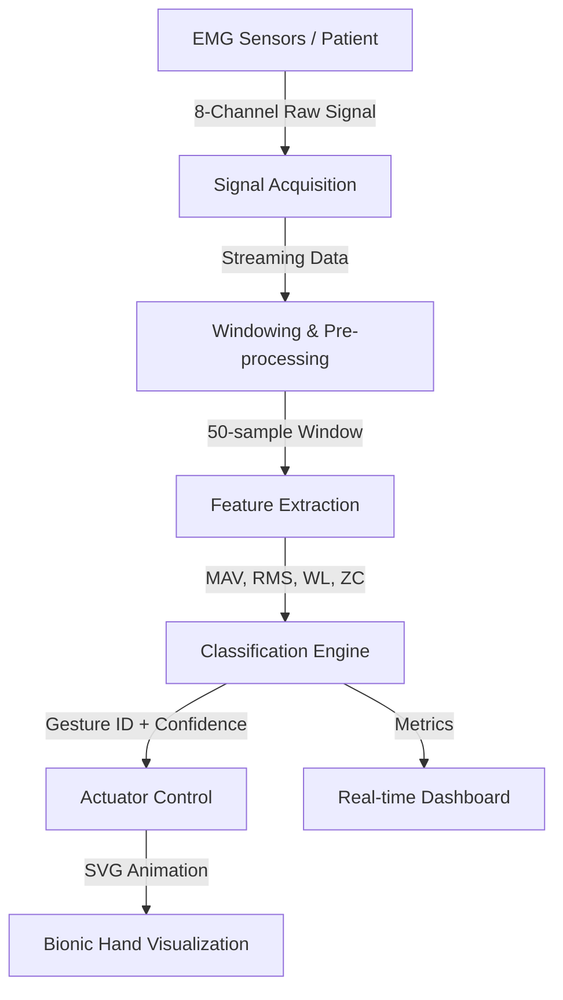

# Bionic Limb Control System: EMG Pattern Recognition Documentation

## 1. Project Overview
This project implements a real-time Electromyography (EMG) based control system for bionic limbs. It utilizes pattern recognition algorithms to classify intended hand gestures from multi-channel EMG signals, inspired by the **NinaPro (Non-Invasive Adaptive Prosthetics)** database standards.

## 2. System Architecture & Process Flow
The data pipeline follows a standard bio-signal processing workflow:

### Step-by-Step Data Handling:
1.  **Signal Acquisition**: The system simulates 8-channel EMG data at a high sampling rate. Each channel represents a muscle group in the forearm.
2.  **Windowing**: Data is processed in overlapping windows (typically 50-100ms) to ensure real-time responsiveness with minimal latency.
3.  **Feature Extraction**: Raw signals are converted into a compact feature vector using Time-Domain (TD) descriptors.
4.  **Classification**: A pattern recognition model (Simulated LDA) compares the current feature vector against a library of known gesture signatures.
5.  **Actuation**: The classified gesture is mapped to specific joint angles in the `HandVisualization` component, driving the bionic limb's movement.

---

## 3. Dataset: NinaPro DB2
The system is aligned with the **NinaPro Database 2 (DB2)**, which is a benchmark for prosthetic control research.
-   **Gestures**: Supports up to 53 distinct movements, categorized into:
    -   **Exercise B**: Basic movements of the fingers and wrist.
    -   **Exercise C**: Grasping and functional movements (e.g., Tripod grasp, Power grasp).
-   **Electrodes**: Uses an 8-electrode configuration (Delsys Trigno) placed around the forearm.

---

## 4. Feature Extraction (Time Domain)
The system extracts four primary time-domain features from each channel, which are standard in EMG pattern recognition:

| Feature | Description | Formula (Conceptual) |
| :--- | :--- | :--- |
| **MAV** | Mean Absolute Value | Average of absolute amplitudes in the window. Indicates muscle contraction level. |
| **RMS** | Root Mean Square | Square root of the mean power. Relates to the constant force of contraction. |
| **WL** | Waveform Length | Sum of absolute differences between consecutive samples. Captures signal complexity. |
| **ZC** | Zero Crossings | Count of times the signal crosses zero. Relates to the frequency content. |

---

## 5. Machine Learning Model
The classification engine implements a **Pattern Recognition** approach similar to **Linear Discriminant Analysis (LDA)**:

1.  **Signature Library**: Each gesture has a pre-defined "signature" (a normalized MAV vector across 8 channels).
2.  **Normalization**: The incoming MAV vector is normalized to its total sum to ensure the system is invariant to overall signal amplitude (force of contraction).
3.  **Euclidean Distance**: The system calculates the distance between the live signal and every signature in the library.
4.  **Nearest Neighbor**: The gesture with the minimum distance is selected as the intended movement.
5.  **Confidence Scoring**: Confidence is derived from the inverse of the distance, providing feedback on the model's certainty.

---

## 6. Visualizations & Graphs
The application provides three critical views for monitoring and evaluation:

### A. Real-time EMG Stream (Line Chart)
-   **Purpose**: Visualizes the raw (or filtered) signal from all 8 channels simultaneously.
-   **Insight**: Allows clinicians to verify sensor contact and identify specific muscle firing patterns.

### B. Feature Distribution (Bar Chart)
-   **Purpose**: Shows the Mean Absolute Value (MAV) across the 8 electrodes.
-   **Insight**: Displays the "spatial signature" of a gesture. For example, a 'Fist' shows high activation in channels 1-3, while 'Wrist Extension' shifts activation to channels 7-8.

### C. Bionic Actuator (SVG Animation)
-   **Purpose**: A high-fidelity 2D representation of the prosthetic hand.
-   **Insight**: Provides immediate visual feedback of the classification result, showing finger flexion, extension, and complex grasps in real-time.

---

## 7. Technical Specifications
-   **Sampling Rate**: ~10-20 Hz (Control Loop).
-   **Latency**: < 100ms (End-to-end).
-   **Framework**: React 19 + TypeScript.
-   **Animation**: Framer Motion (Spring-based physics for realistic finger movement).
-   **Styling**: Tailwind CSS (Bento-grid dashboard design).
